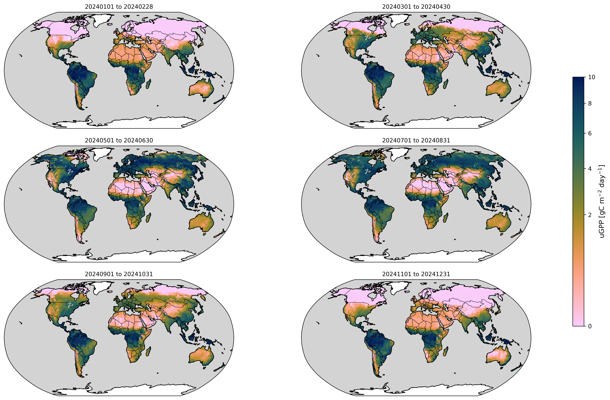
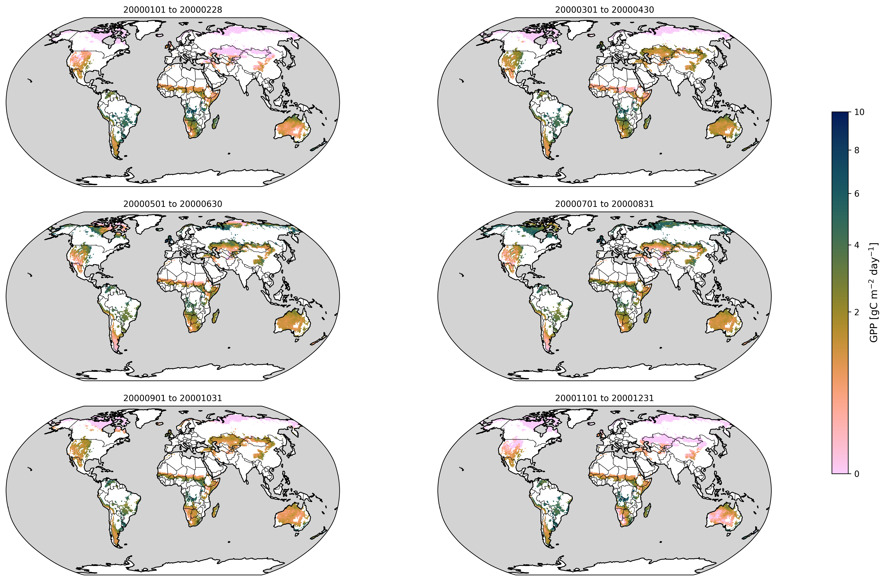
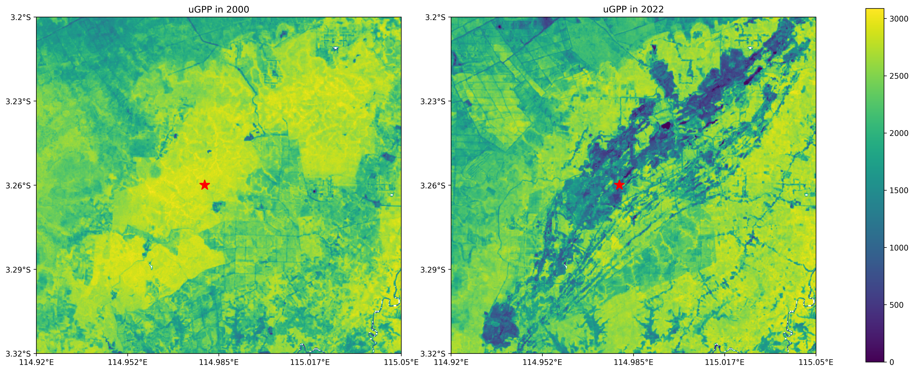
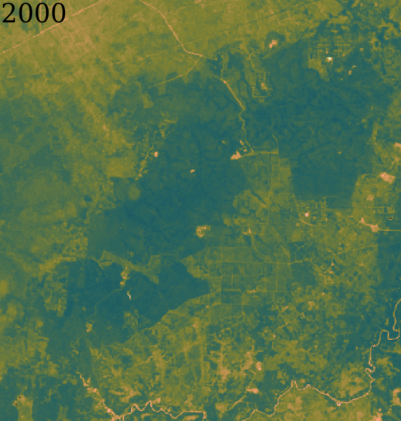
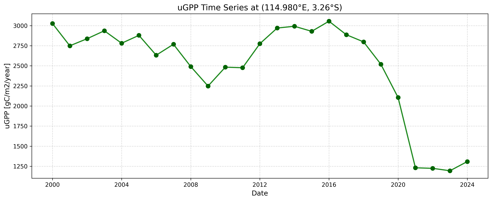

# Global Gross Primary Productivity (GPP) maps at 30-m resolution (2000–2022)

Here you can find an modeling framework to estimate [global Gross Primary Productivity (GPP)] using multi-source Earth Observation (EO) data and Light Use Efficiency (LUE). The data set is based on using reconstructed global complete consistent bimonthly Landsat cloud-free (400TB of data), combined with 1 km MOD11A1 temperature data and 1◦ CERES Photosynthetically Active Radiation (PAR). 

The LUE model was implemented by taking the biome-specific productivity factor (maximum LUE parameter) as a global constant, producing a global bimonthly (uncalibrated) productivity data for the complete land mask. Later, the GPP 30 m bimonthly maps were derived for the global grassland annual predictions and calibrating the values based on the maximum LUE factor of 0.86 g C m−2 d−1 MJ−1. The results of validation of the produced GPP estimates based on more than 500 eddy covariance flux towers show an R-square between 0.48–0.71 and RMSE below ∼ 2.3 g C m−2 d−1 for all land cover classes.


## How to Cite

Isik, M. S., Parente, L., Consoli, D., Sloat, L., Mesquita, V. V., Ferreira, L. G., Sabbatini, S., Stanimirova, R., Teles, N. M., Robinson, N., Costa Junior, C., & Hengl, T. (2025).  
*Light use efficiency (LUE) based bimonthly gross primary productivity (GPP) for global grasslands at 30 m spatial resolution (2000–2022).*  
**PeerJ, 13**, e19774. https://doi.org/10.7717/peerj.19774

### BibTeX

```bibtex
@article{Isik2025,
   author = {Mustafa Serkan Isik and Leandro Parente and Davide Consoli and Lindsey Sloat and Vinicius Vieira Mesquita and Laerte Guimaraes Ferreira and Simone Sabbatini and Radost Stanimirova and Nathalia Monteiro Teles and Nathaniel Robinson and Ciniro Costa Junior and Tomislav Hengl},
   doi = {10.7717/peerj.19774},
   issn = {2167-8359},
   journal = {PeerJ},
   month = {8},
   pages = {e19774},
   title = {Light use efficiency (LUE) based bimonthly gross primary productivity (GPP) for global grasslands at 30 m spatial resolution (2000–2022)},
   volume = {13},
   year = {2025}
}
```

## Working with GPP data layers: An Introductory Tutorial

This tutorial provides an overview on how to access bimonthly and annual GPP layers (uGPP and grassland GPP), as well as practical methods for analyzing and visualizing productivity patterns using Python tools.

* * *

```python
import numpy as np
import rasterio
from rasterio.windows import from_bounds
from rasterio.vrt import WarpedVRT
import matplotlib.pyplot as plt
import matplotlib as mpl
from matplotlib.colors import PowerNorm
import cartopy.crs as ccrs
import cartopy.feature as cfeature
from cartopy.mpl.ticker import LongitudeFormatter, LatitudeFormatter
from rasterio.transform import array_bounds
import cmcrameri.cm as cmc
from matplotlib.colors import ListedColormap
from pystac_client import Client
import warnings

```

* * *

# Bimonthly and Annual GPP Products via OpenLandMap STAC

Bimonthly and annual Gross Primary Productivity (GPP) products are available through the **SpatioTemporal Asset Catalog (STAC)** of [OpenLandMap](https://stac.openlandmap.org).

- **Uncalibrated GPP (uGPP), daily model outputs at 30 m:**  
    [`gpw_ugpp.daily-30m`](https://stac.openlandmap.org/gpw_ugpp.daily-30m/collection.json)  
    Bimonthly uncalibrated GPP estimates at 30 m resolution \[unit: gC/m2/day\].
    
- **Uncalibrated GPP (uGPP), annual aggregates at 30 m:**  
    [`gpw_ugpp-30m`](https://stac.openlandmap.org/gpw_ugpp-30m/collection.json)  
    Annual mean of bimonthly uGPP values at 30 m resolution \[unit: gC/m2/year\].
    
- **GPP for grasslands, daily model outputs at 30 m:**  
    [`gpw_gpp.daily.grass-30m`](https://stac.openlandmap.org/gpw_gpp.daily.grass-30m/collection.json)  
    Bimonthly GPP estimates at 30 m resolution, specifically for grassland biomes \[unit: gC/m2/day\].
    
- **Calibrated GPP for grasslands, annual aggregates at 30 m:**  
    [`gpw_gpp.grass-30m`](https://stac.openlandmap.org/gpw_gpp.grass-30m/collection.json)  
    Annual mean of bimonthly GPP for grasslands at 30 m resolution \[unit: gC/m2/year\].
    

* * *

**Let’s try to access the bimonthly uncalibrated GPP layers** (`gpw_ugpp.daily-30m`) programmatically using the STAC API.

## How to access the links on STAC catalog

```python
def get_s3_links(catalog_url: str, target_collection: str, target_item: str):
    """
    Extracts S3 links for a given item in a target collection of a STAC catalog.

    Parameters
    ----------
    catalog_url : str
        URL of the STAC catalog.
    target_collection : str
        ID of the target collection within the catalog.
    target_item : str
        Name of the asset within each item whose S3 links should be extracted.

    Returns
    -------
    list[str]
        List of S3 href links for the requested asset.
    """
    with warnings.catch_warnings():
        warnings.simplefilter("ignore")
        catalog = Client.open(catalog_url)
        collection = next((c for c in catalog.get_collections() if c.id == target_collection), None)
        if collection:
            return [
                item.to_dict()['assets'][target_item]['href']
                for item in collection.get_all_items()
                if target_item in item.to_dict().get('assets', {})
            ]
        return []

gpp_layers = get_s3_links(
    "https://s3.eu-central-1.wasabisys.com/stac/openlandmap/catalog.json",
    "gpw_ugpp.daily-30m",
    "gpw_ugpp.daily_lue.model_m_30m"
)

print("The number of bimonthly uGPP layers found:", len(gpp_layers))
```

```
The number of bimonthly uGPP layers found: 150
```

Since there are **6 bimonthly time steps** per year between **2000** and **2024**, this results in **150 bimonthly layers** for the uncalibrated GPP dataset.

For each year, the bimonthly periods are predefined as follows:

```python
dates = [
    'YYYY0101_YYYY0228',  # January-February
    'YYYY0301_YYYY0430',  # March-April
    'YYYY0501_YYYY0630',  # May-June
    'YYYY0701_YYYY0831',  # July-August
    'YYYY0901_YYYY1031',  # September-October
    'YYYY1101_YYYY1231'   # November-December
]
```

```python
gpp_layer[0]
```

```
'https://s3.opengeohub.org/gpw/arco/gpw_ugpp.daily_lue.model_m_30m_s_20000101_20000228_go_epsg.4326_v1.tif'
```

```python
fig, axes = plt.subplots(
    3, 2, figsize=(18, 12),
    subplot_kw={'projection': ccrs.Robinson()}
)
plt.subplots_adjust(wspace=0.05, hspace=0.15)

# Colormap
norm = PowerNorm(gamma=0.5, vmin=0, vmax=10)
cmap = cmc.batlow_r
cmap.set_bad(color="white")

year = 2024
im = None  # placeholder to capture the last image
for ax, date_tpl in zip(axes.flat, dates):
    date = date_tpl.replace("YYYY", str(year))
    subtitle = f"{date[:8]} to {date[9:]}"
    ax.set_title(subtitle, fontsize=10)

    url = f'https://s3.opengeohub.org/gpw/arco/gpw_ugpp.daily_lue.model_m_30m_s_{date}_go_epsg.4326_v1.tif'
    with rasterio.open(url) as dataset:
        nodata = dataset.nodata
        scale = dataset.scales
        overviews = dataset.overviews(1)
        img_extent = [dataset.bounds.left, dataset.bounds.right, dataset.bounds.bottom, dataset.bounds.top]
        oview_level = overviews[-1]
        overview_data = dataset.read(
            1,
            out_shape=(1, int(dataset.height // oview_level), int(dataset.width // oview_level))
        )

    overview_data = np.ma.masked_where(overview_data == nodata, overview_data)
    im = ax.imshow(
        overview_data * scale,
        extent=img_extent,
        transform=ccrs.PlateCarree(),
        cmap=cmap,
        norm=norm,
        interpolation='nearest'
    )

    ax.coastlines()
    ax.add_feature(cfeature.BORDERS, linewidth=0.5)
    ax.add_feature(cfeature.OCEAN, facecolor="lightgray", zorder=0) 

cbar_ax = fig.add_axes([0.92, 0.25, 0.015, 0.5])
cbar = fig.colorbar(im, cax=cbar_ax)
cbar.set_label("uGPP [gC m$^{-2}$ day$^{-1}$]", fontsize=12)
cbar.ax.tick_params(labelsize=10)
```



To access bimonthly GPP values in grasslands, calibrated via MOD17 parameters, we need to change the catalog name and the target item.

```python
gpp_layers = get_s3_links(
    "https://s3.eu-central-1.wasabisys.com/stac/openlandmap/catalog.json",
    "gpw_gpp.daily.grass-30m",
    "gpw_gpp.daily.grass_lue.model_m_30m"
)

print("The number of bimonthly grassland GPP layers found:", len(gpp_layers))
```

```
The number of bimonthly grassland GPP layers found: 138
```

```python
gpp_layers[0]
```

```
'https://s3.opengeohub.org/gpw/arco/gpw_gpp.daily.grass_lue.model_m_30m_s_20000101_20000228_go_epsg.4326_v1.tif'
```

```python
fig, axes = plt.subplots(
    3, 2, figsize=(18, 12),
    subplot_kw={'projection': ccrs.Robinson()}
)
plt.subplots_adjust(wspace=0.05, hspace=0.15)

# Colormap
norm = PowerNorm(gamma=0.5, vmin=0, vmax=10)
cmap = cmc.batlow_r
cmap.set_bad(color="white")

year = 2000
for ax, date_tpl in zip(axes.flat, dates):
    date = date_tpl.replace("YYYY", str(year))
    
    subtitle = f"{date[:8]} to {date[9:]}"
    ax.set_title(subtitle, fontsize=10)
    
    url = f'https://s3.opengeohub.org/gpw/arco/gpw_gpp.daily.grass_lue.model_m_30m_s_{date}_go_epsg.4326_v1.tif'
    with rasterio.open(url) as dataset:
        nodata = dataset.nodata
        scale = dataset.scales
        overviews = dataset.overviews(1)
        img_extent = [dataset.bounds.left, dataset.bounds.right, dataset.bounds.bottom, dataset.bounds.top]
        oview_level = overviews[-1]
        overview_data = dataset.read(
            1,
            out_shape=(1, int(dataset.height // oview_level), int(dataset.width // oview_level))
        )
        

    overview_data = np.ma.masked_where(overview_data == nodata, overview_data)
    im = ax.imshow(
        overview_data * scale,
        extent=img_extent,
        transform=ccrs.PlateCarree(),
        cmap=cmap,
        norm=norm,
        interpolation='nearest'
    )

    ax.coastlines()
    ax.add_feature(cfeature.BORDERS, linewidth=0.5)
    ax.add_feature(cfeature.OCEAN, facecolor="lightgray", zorder=0) 

cbar_ax = fig.add_axes([0.92, 0.25, 0.015, 0.5]) 
cbar = fig.colorbar(im, cax=cbar_ax)
cbar.set_label("GPP [gC m$^{-2}$ day$^{-1}$]", fontsize=12)
cbar.ax.tick_params(labelsize=10)
```



```python
gpp_layers = get_s3_links(
    "https://s3.eu-central-1.wasabisys.com/stac/openlandmap/catalog.json",
    "gpw_ugpp-30m",
    "gpw_ugpp_lue.model_m_30m"
)

print("The number of annual uGPP layers found:", len(gpp_layers))
```

```
The number of annual uGPP layers found: 25
```

```python
gpp_layers[0]
```

```
'https://s3.opengeohub.org/gpw/arco/gpw_ugpp_lue.model_m_30m_s_20000101_20001231_go_epsg.4326_v1.tif'
```

```python
def extract_region_from_cog(
    s3_url: str,
    min_lon: float,
    min_lat: float,
    max_lon: float,
    max_lat: float,
    dst_crs: str = "EPSG:4326"
):
    """
    Extract a region from a Cloud-Optimized GeoTIFF (COG) defined by a lat/lon bounding box.

    Parameters
    ----------
    s3_url : str
        The S3 link to the COG.
    min_lon : float
        Minimum longitude of the region.
    min_lat : float
        Minimum latitude of the region.
    max_lon : float
        Maximum longitude of the region.
    max_lat : float
        Maximum latitude of the region.
    dst_crs : str, optional
        Target coordinate reference system (default: EPSG:4326).

    Returns
    -------
    data : numpy.ma.MaskedArray
        The pixel values inside the bounding box with nodata masked.
    transform : affine.Affine
        The affine transform for the extracted data.
    """
    with rasterio.Env():
        with rasterio.open(s3_url) as src:
            # Reproject on the fly
            with WarpedVRT(src, crs=dst_crs) as vrt:
                window = from_bounds(min_lon, min_lat, max_lon, max_lat, vrt.transform)

                # Read the data inside the window with nodata masked
                data = vrt.read(1, window=window, masked=True)
                transform = vrt.window_transform(window)

                return data, transform

```

```python
gpp_layers[0]
```

```
'https://s3.opengeohub.org/gpw/arco/gpw_ugpp_lue.model_m_30m_s_20000101_20001231_go_epsg.4326_v1.tif'
```

```python
data_2000, transform_2000 = extract_region_from_cog(
    gpp_layers[0],
    min_lon=114.92, min_lat=-3.32,
    max_lon=115.05, max_lat=-3.20
)

data_2022, transform_2022 = extract_region_from_cog(
    gpp_layers[-1],
    min_lon=114.92, min_lat=-3.32,
    max_lon=115.05, max_lat=-3.20
)
```

```python

height, width = data.shape
bounds = array_bounds(height, width, transform)
minx, miny, maxx, maxy = bounds
extent = (minx, maxx, miny, maxy)

fig = plt.figure(figsize=(20, 12))
gs = fig.add_gridspec(1, 3, width_ratios=[1, 1, 0.05])  

ax1 = fig.add_subplot(gs[0,0], projection=ccrs.PlateCarree())
ax2 = fig.add_subplot(gs[0,1], projection=ccrs.PlateCarree())
cax = fig.add_subplot(gs[0,2])

im1 = ax1.imshow(
    data_2000,
    origin="upper",
    extent=extent,
    transform=ccrs.PlateCarree(),
    cmap="viridis"
)
im2 = ax2.imshow(
    data_2022,
    origin="upper",
    extent=extent,
    transform=ccrs.PlateCarree(),
    cmap="viridis"
)

ax1.set_title("uGPP in 2000")
ax2.set_title("uGPP in 2022")

for ax in [ax1, ax2]:
    ax.set_xticks(np.linspace(minx, maxx, 5), crs=ccrs.PlateCarree())
    ax.set_yticks(np.linspace(miny, maxy, 5), crs=ccrs.PlateCarree())
    ax.xaxis.set_major_formatter(LongitudeFormatter())
    ax.yaxis.set_major_formatter(LatitudeFormatter())

# Add marker for POI on both maps
lon, lat = 114.980, -3.26
for ax in [ax1, ax2]:
    ax.plot(lon, lat, marker="*", color="red", markersize=14,
            transform=ccrs.PlateCarree(), label="POI")

fig.colorbar(im2, cax=cax)
pos = cax.get_position()
cax.set_position([pos.x0, pos.y0 + pos.height*0.15, pos.width, pos.height*0.7])
plt.show()
```



Here is a GIF illustrating the change in GPP between 2000 and 2024 in this region, displayed with Google Satellite imagery in three consecutive frames.



The red star in the maps marks our Point of Interest (POI). By extracting its pixel values across all years, we can plot a time series of uGPP. This reveals not only gradual trends but also a distinct breakpoint where GPP drops sharply after deforestation. Before the event, values remain stable, reflecting intact forest productivity; afterwards, they decline significantly, highlighting the loss of canopy photosynthesis.

```python
# Point of interest (central location in the figure above)
lon, lat = 114.980, -3.26

def extract_date_from_filename(href: str):
    m = re.search(r"_(\d{8})_(\d{8})_", href)
    if m:
        start, end = m.groups()
        return pd.to_datetime(start, format="%Y%m%d"), pd.to_datetime(end, format="%Y%m%d")
    return None, None


def sample_pixel(href: str, lon: float, lat: float):
    with rasterio.open(href) as ds:
        row, col = ds.index(lon, lat)
        if (0 <= row < ds.height) and (0 <= col < ds.width):
            window = Window(col, row, 1, 1)
            val = ds.read(1, window=window)[0, 0]
            if val == ds.nodata:
                return np.nan
            return val
        else:
            return np.nan

records = []
for href in gpp_layers:
    start, end = extract_date_from_filename(href)
    val = sample_pixel(href, lon, lat)
    records.append({"start_date": start, "end_date": end, "value": val, "href": href})

df_ts = pd.DataFrame(records)
```

```python
plt.figure(figsize=(12,5))
plt.plot(df_ts["start_date"], df_ts["value"], marker="o", linestyle="-", color="forestgreen", linewidth=2)
plt.scatter(df_ts["start_date"], df_ts["value"], color="darkgreen", s=50, zorder=3)

plt.title("uGPP Time Series at (114.980°E, 3.26°S)", fontsize=14)
plt.xlabel("Date", fontsize=12)
plt.ylabel("uGPP [gC/m2/year]", fontsize=12)
plt.grid(True, linestyle="--", alpha=0.5)
plt.tight_layout()
plt.show()
```


