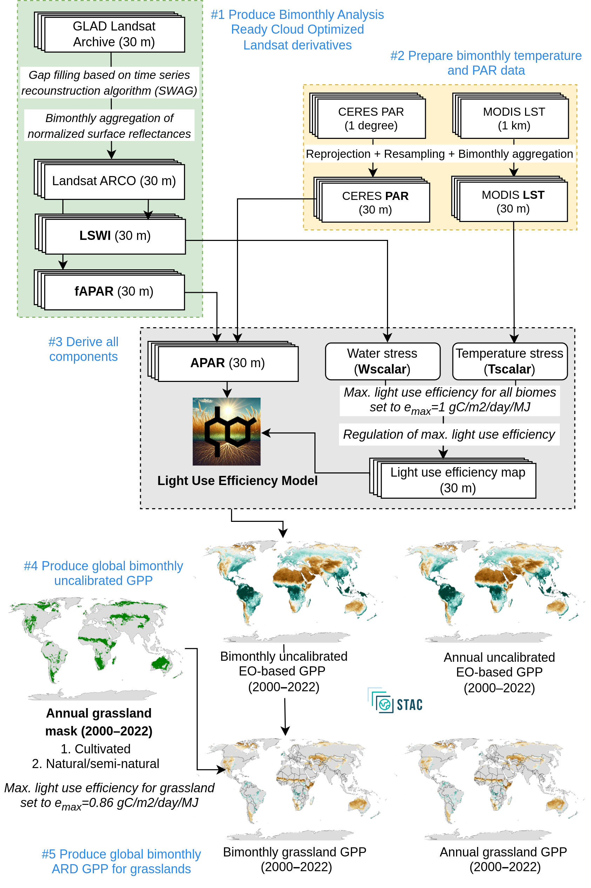

# Global Gross Primary Productivity (GPP) maps at 30-m resolution (2000–2022)

Here you can find an modeling framework to estimate [global Gross Primary Productivity (GPP)] using multi-source Earth Observation (EO) data and Light Use Efficiency (LUE). The data set is based on using reconstructed global complete consistent bimonthly Landsat cloud-free (400TB of data), combined with 1 km MOD11A1 temperature data and 1◦ CERES Photosynthetically Active Radiation (PAR). 

The LUE model was implemented by taking the biome-specific productivity factor (maximum LUE parameter) as a global constant, producing a global bimonthly (uncalibrated) productivity data for the complete land mask. Later, the GPP 30 m bimonthly maps were derived for the global grassland annual predictions and calibrating the values based on the maximum LUE factor of 0.86 g C m−2 d−1 MJ−1. The results of validation of the produced GPP estimates based on more than 500 eddy covariance flux towers show an R-square between 0.48–0.71 and RMSE below ∼ 2.3 g C m−2 d−1 for all land cover classes.

